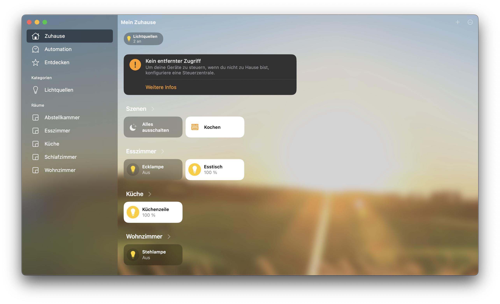
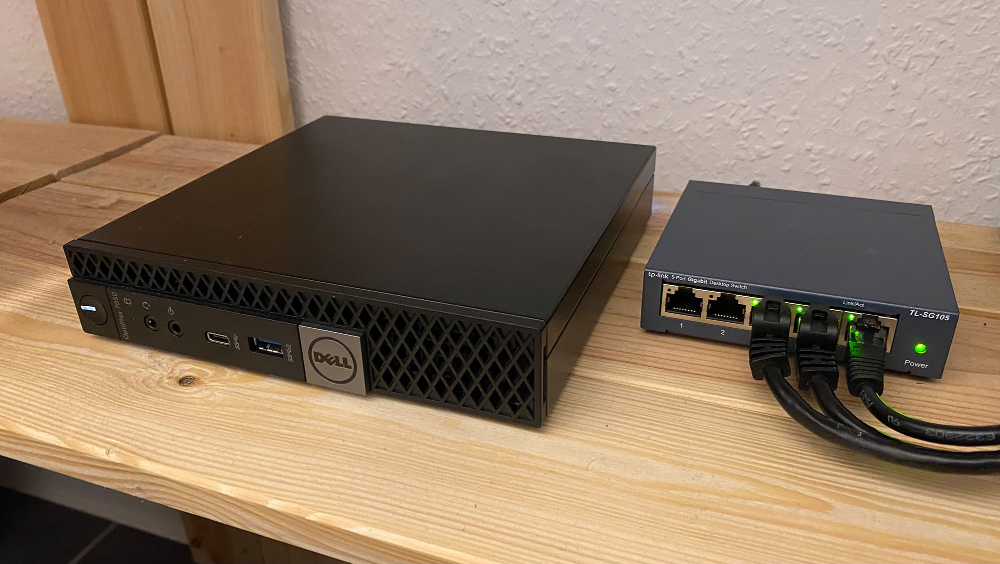

# docker-home-server

With this docker-compose file you can set up a whole home server stack, consisting of [Homebridge](https://homebridge.io/) and [deCONZ](https://www.dresden-elektronik.com/wireless/software/deconz.html). They allow me to control my ZigBee devices with Apple HomeKit.

## Usage

1. Clone the repository
2. Copy `.env.example` to `.env`
3. Within `.env` set up your configuration properties
4. Run `docker-compose up -d`

## Hardware

I'm using a Dell OptiPlex 7050 as server which is located in my storage room and is accessed via SSH. Such units can be purchased as lease returns in good condition at cheap prices. To interface with ZigBee devices I'm using the [ConBee II](https://phoscon.de/en/conbee2) stick by dresden elektronik. The actual light bulbs are mostly IKEA TRADFRI light bulbs.

